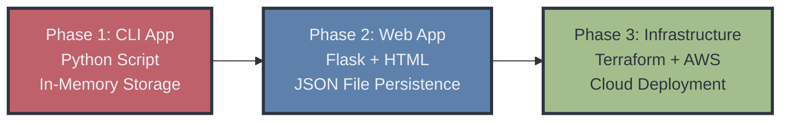

# 🖥️ IT Asset Management System


> A Flask web application for managing IT assets with persistent file-based storage. Track hardware, accessories, licenses, and user assignments through an intuitive web interface.

**Author:** Artiom Krits | **GitHub:** [@ArtiomKrits92](https://github.com/ArtiomKrits92)

---

## 📑 Table of Contents

- [Overview](#-overview)
- [Key Highlights](#-key-highlights)
- [Architecture Evolution](#-architecture-evolution)
- [Tech Stack](#-tech-stack)
- [Features](#-features)
- [Data Persistence](#-data-persistence)
- [Getting Started](#-getting-started)
  - [Containerization with Docker](#23-containerization-with-docker)
  - [Infrastructure as Code with Terraform](#24-infrastructure-as-code-with-terraform)
  - [Configuration Management with Ansible](#25-configuration-management-with-ansible)
- [Project Structure](#-project-structure)
- [API Endpoints](#-api-endpoints)
- [Lessons Learned](#-lessons-learned)
- [License](#-license)

---

## 🎯 Overview

The IT Asset Management System is a Flask web application designed to track, manage, and organize IT assets within an organization. The application provides a user-friendly web interface for managing inventory, users, and asset assignments with automatic data persistence to JSON files.

**Key Capabilities:**
- Track IT assets, accessories, and software licenses
- Assign assets to users
- Monitor inventory levels and stock valuation
- Generate reports by category and user
- Persistent data storage with JSON file-based backend

---

## 🎯 Key Highlights

- **Full CRUD operations with persistent storage** - Create, read, update, and delete assets and users with automatic JSON file persistence
- **Bootstrap-powered responsive UI** - Modern, mobile-friendly interface built with Bootstrap 5.3
- **Real-time inventory analytics** - Dashboard with live statistics, stock valuation, and category-based reporting
- **Multi-user asset assignment system** - Assign and track IT assets across multiple users with detailed assignment history
- **RESTful API design** - Clean, intuitive route structure following REST principles for easy extension

---

## 🏗️ Architecture Evolution

The project evolved from a command-line interface to a full-featured web application:



**Phase 1 → Phase 2 Improvements:**
- **Interface**: Command-line → Web-based UI with Bootstrap styling
- **Data Storage**: In-memory dictionaries → Persistent JSON files
- **User Experience**: Terminal interactions → Intuitive web forms and navigation
- **Accessibility**: Single-user script → Multi-user web application

**Phase 2 → Phase 3 Improvements:**
- **Infrastructure**: Manual AWS setup → Automated Terraform provisioning
- **Deployment**: Single local machine → Multi-instance cloud cluster
- **Scalability**: Limited by local resources → Cloud-based with load balancing
- **Repeatability**: Manual recreation → Infrastructure as code

---

## 🛠️ Tech Stack

### Frontend
- **HTML5/CSS3** - Modern, responsive web interface
- **Bootstrap 5.3** - UI framework for professional styling
- **Jinja2 Templates** - Server-side templating engine

### Backend
- **Python 3.13** - Core programming language
- **Flask 3.0** - Lightweight web framework
- **JSON** - File-based data persistence

### Development Tools
- **Git** - Version control
- **Virtual Environment** - Python dependency isolation

### Infrastructure
- **Terraform** - Infrastructure as Code
- **Docker** - Containerization platform
- **AWS** - Cloud infrastructure (VPC, EC2, Load Balancer)

---

## ✨ Features

### Asset Management
- ➕ Add new IT assets (hardware, accessories, licenses)
- 🗑️ Delete assets from inventory
- ✏️ Modify existing asset details
- 📋 View all assets with filtering options

### User Management
- 👤 Add new users to the system
- 📊 View all registered users
- 🔗 Assign assets to specific users
- 📦 View assets assigned to each user

### Reporting & Analytics
- 📈 Dashboard with key metrics (total users, items, stock status)
- 💰 Stock valuation by category (Assets, Accessories, Licenses)
- 📊 Inventory status tracking (In Stock / Assigned)
- 🔍 Category-based filtering and reporting

---

## 💾 Data Persistence

The application uses JSON file-based persistence for simplicity and portability:

- **Storage Location**: `data/` directory (at project root)
- **Files**: 
  - `items.json` - Asset inventory data
  - `users.json` - User registry and assignments
- **Automatic Operations**:
  - Data is automatically saved after each modification
  - Data is loaded on application startup
  - Files are created automatically if they don't exist

**File Format Example:**
```json
{
  "1": {
    "id": "1",
    "main_category": "Assets",
    "sub_category": "Laptop",
    "manufacturer": "Dell",
    "model": "XPS 15",
    "price": 1299.99,
    "quantity": 1,
    "status": "In Stock",
    "assigned_to": null
  }
}
```

---

## 🚀 Getting Started

### Prerequisites

- Python 3.13 or higher
- pip (Python package manager)

### Local Development

1. **Clone the repository**
   ```bash
   git clone https://github.com/ArtiomKrits92/Devops_Final_Project.git
   cd Devops_Final_Project
   ```

2. **Create and activate virtual environment**
   ```bash
   python3 -m venv venv
   source venv/bin/activate  # On Windows: venv\Scripts\activate
   ```

3. **Install dependencies**
   ```bash
   pip install -r requirements.txt
   ```

4. **Run the application**
   ```bash
   cd website
   python app.py
   ```

5. **Access the application**
   - Open your browser and navigate to `http://localhost:31415`
   - The application will automatically create data files in `data/` directory on first run

### 2.3 Containerization with Docker

The application has been containerized using Docker for consistent deployment across different environments. Docker ensures that the application runs the same way on any machine, whether it's a developer's laptop or a production server.

**Why Python 3.9-slim?**

We chose Python 3.9-slim as the base image for a good balance between image size and compatibility:
- **Size**: The slim variant is approximately 226MB, compared to ~900MB for the full Python image
- **Compatibility**: Python 3.9 provides excellent compatibility with Flask and all required dependencies
- **Alpine Alternative**: While Alpine Linux images are smaller (~50MB), they can have compatibility issues with some Python packages that require compiled extensions

**Docker Files Overview:**

1. **Dockerfile** - Defines how to build the container image:
   - Uses Python 3.9-slim base image
   - Copies application files from `website/` directory
   - Installs Flask and dependencies
   - Creates data directory for persistence
   - Exposes port 31415 for the Flask application

2. **.dockerignore** - Excludes unnecessary files from the build context:
   - Python cache files (`__pycache__/`, `*.pyc`)
   - Git files and virtual environments
   - Documentation and log files
   - This reduces build time and image size

3. **docker-compose.yml** - Simplifies container management:
   - Defines service configuration
   - Maps port 31415 to host
   - Mounts `./data` volume for persistent storage
   - Sets environment variables

**Docker Commands:**

**Build the image:**
```bash
docker build -t asset-manager:latest .
```

**Run container manually:**
```bash
docker run -d -p 31415:31415 -v $(pwd)/data:/data asset-manager:latest
```

**Run with Docker Compose (recommended):**
```bash
docker-compose up -d
```

**Stop the container:**
```bash
docker-compose down
```

**Access the application:**
- Once running, navigate to `http://localhost:31415` in your browser
- Data files are persisted in the `./data` directory on your host machine

**Docker Hub:**
The containerized application is available on Docker Hub:
- **Image**: [artie92/asset-manager:latest](https://hub.docker.com/r/artie92/asset-manager)

You can pull and run the image directly:
```bash
docker pull artie92/asset-manager:latest
docker run -d -p 31415:31415 -v $(pwd)/data:/data artie92/asset-manager:latest
```

### 2.4 Infrastructure as Code with Terraform

Terraform allows you to define your AWS infrastructure as code instead of manually clicking through the AWS Console. This approach makes your infrastructure reproducible, version-controlled, and easy to deploy multiple times. For student projects, this is particularly useful because you often need to tear down and rebuild environments frequently due to AWS Academy time limits and budget constraints.

#### 2.4.1 Why Terraform

Instead of manually creating VPCs, subnets, security groups, and EC2 instances through the AWS Console, Terraform lets you write configuration files that describe exactly what infrastructure you need. When you run `terraform apply`, Terraform creates all the resources automatically. If you need to destroy everything (like when your AWS Academy lab time expires), you just run `terraform destroy` and everything is removed cleanly.

This is especially valuable for DevOps projects where you need to:
- Recreate the same infrastructure multiple times for testing
- Share infrastructure configurations with teammates
- Keep track of changes to your infrastructure over time
- Quickly tear down resources to avoid unexpected charges

#### 2.4.2 Infrastructure Components

The Terraform configuration in this project creates the following AWS resources:

- **VPC** with CIDR block `10.0.0.0/16` - The virtual network that contains all our resources
- **Two public subnets** in different availability zones:
  - Subnet 1: `10.0.1.0/24` (default availability zone)
  - Subnet 2: `10.0.2.0/24` in `us-east-1b`
- **Internet Gateway** - Provides internet access for resources in the public subnets
- **Route tables** - Configured to route all internet traffic (`0.0.0.0/0`) through the Internet Gateway
- **Security groups**:
  - Load balancer security group allowing HTTP traffic on port 80 from anywhere
  - Instance security group allowing:
    - SSH access on port 22
    - Kubernetes API on port 6443
    - NodePort for application on port 30080
    - NFS server on port 2049
    - Kubelet API on port 10250
- **Three EC2 instances** (t2.medium):
  - Master node at private IP `10.0.1.10`
  - Worker node 1 at private IP `10.0.1.11`
  - Worker node 2 at private IP `10.0.1.12`
- **Application Load Balancer** - Distributes traffic across instances in multiple availability zones
- **Target group** - Health checks and load balancing configuration for port 30080
- **Target group attachments** - Registers all three EC2 instances with the load balancer

#### 2.4.3 Terraform Commands

**Installation on macOS:**

```bash
brew tap hashicorp/tap
brew install hashicorp/tap/terraform
terraform version
```

**Basic workflow:**

```bash
cd terraform/

terraform init      # Initialize and download AWS provider
terraform fmt       # Format code
terraform validate  # Check syntax
terraform plan      # Preview changes
terraform apply     # Create infrastructure
terraform destroy   # Delete everything
```

**Important:** Before running `terraform apply`, you must configure your AWS credentials. For AWS Academy users, export the credentials as environment variables from the AWS Details panel:

```bash
export AWS_ACCESS_KEY_ID="your-access-key"
export AWS_SECRET_ACCESS_KEY="your-secret-key"
export AWS_SESSION_TOKEN="your-session-token"
```

The `terraform plan` command shows you exactly what will be created, modified, or destroyed before you actually make any changes. This is a safety feature that helps prevent mistakes.

### 2.5 Configuration Management with Ansible

Ansible automates server configuration tasks. After Terraform creates the EC2 instances, they are just blank Ubuntu servers. Ansible connects via SSH and runs commands to install Docker, Kubernetes, and configure the cluster automatically. This eliminates the need to manually SSH into each of the three servers and repeat the same installation steps. For student projects, this is valuable because you can destroy and recreate your infrastructure multiple times and Ansible will consistently configure it the same way each time.

#### 2.5.1 Why Ansible

Instead of manually SSHing into each server and running installation commands one by one, Ansible uses playbooks to automate the entire configuration process. When you run an Ansible playbook, it connects to all specified servers simultaneously and executes the same commands on each one. This ensures consistency across all nodes and saves significant time, especially when you need to set up multiple servers.

This automation is particularly useful for DevOps projects where you need to:
- Configure multiple servers with identical settings
- Recreate infrastructure frequently (like with AWS Academy time limits)
- Ensure all servers are configured exactly the same way
- Reduce human error from manual configuration steps

#### 2.5.2 Playbook Overview

The Ansible configuration consists of four playbooks that run in sequence:

1. **01-common-setup.yml** - Runs on all nodes (master and workers):
   - Installs Docker, kubeadm, kubelet, and kubectl
   - Configures Docker daemon for Kubernetes compatibility
   - Disables swap memory (required for Kubernetes)

2. **02-master-setup.yml** - Runs on master node only:
   - Initializes Kubernetes cluster using `kubeadm init`
   - Configures kubectl for the ubuntu user
   - Installs Calico network plugin for pod networking
   - Generates join command for worker nodes

3. **03-worker-setup.yml** - Runs on worker nodes:
   - Fetches join command from master node
   - Joins workers to the Kubernetes cluster using the join command

4. **04-nfs-setup.yml** - Sets up persistent storage:
   - Configures NFS server on master node
   - Creates shared directory for persistent volumes
   - Mounts the NFS share on worker nodes
   - Enables NFS service to start on boot

#### 2.5.3 Ansible Commands

**Installation on macOS:**

```bash
brew install ansible
ansible --version
```

**Running playbooks (execute in order):**

```bash
cd ansible/

# Run each playbook in sequence
ansible-playbook -i inventory.ini playbooks/01-common-setup.yml
ansible-playbook -i inventory.ini playbooks/02-master-setup.yml
ansible-playbook -i inventory.ini playbooks/03-worker-setup.yml
ansible-playbook -i inventory.ini playbooks/04-nfs-setup.yml
```

**Note:** Before running Ansible, you must have the SSH private key (`cluster-key.pem`) in your `~/.ssh/` directory with proper permissions:

```bash
chmod 400 ~/.ssh/cluster-key.pem
```

**Verify cluster status:**

After all playbooks complete, you can verify the Kubernetes cluster is running:

```bash
ssh -i ~/.ssh/cluster-key.pem ubuntu@<master-ip>
kubectl get nodes
```

You should see all three nodes (one master and two workers) in "Ready" status.

---

## 📁 Project Structure

```
Devops_Final_Project/
│
├── ansible/                               # Configuration Management
│   ├── ansible.cfg                        # Ansible configuration
│   ├── inventory.ini                     # EC2 instances inventory
│   ├── playbooks/                         # Automation playbooks
│   │   ├── 01-common-setup.yml            # Install Docker & K8s on all nodes
│   │   ├── 02-master-setup.yml            # Initialize K8s master
│   │   ├── 03-worker-setup.yml            # Join workers to cluster
│   │   └── 04-nfs-setup.yml               # Setup shared storage
│   └── files/
│       └── daemon.json                    # Docker configuration
│
├── data/                                  # Data persistence directory
│   ├── items.json                         # Asset inventory data
│   └── users.json                         # User registry data
│
├── terraform/                             # Infrastructure as Code
│   ├── main.tf                            # AWS resources definition
│   ├── variables.tf                       # Input variables
│   ├── outputs.tf                          # Output values (IPs, URLs)
│   └── terraform.tfvars.example            # Example variable values
│
├── venv/                                  # Python virtual environment
│
├── website/                               # Main application directory
│   ├── app.py                             # Flask application entry point
│   ├── data.py                            # Data models and in-memory databases
│   ├── file_manager.py                    # File persistence layer
│   ├── demo.py                            # Demo data initialization
│   │
│   └── templates/                         # Jinja2 HTML templates
│       ├── base.html                      # Base template with navigation
│       ├── index.html                     # Dashboard/homepage
│       ├── add_item.html                  # Add asset form
│       ├── delete_item.html               # Delete asset form
│       ├── modify_item_select.html        # Select item to modify
│       ├── modify_item_form.html          # Modify asset form
│       ├── assign_item.html               # Assign asset to user
│       ├── add_user.html                  # Add user form
│       ├── show_users.html                # User listing
│       ├── show_user_items_select.html    # Select user to view items
│       ├── show_user_items.html           # View user's assigned assets
│       ├── show_stock_items.html          # Inventory listing
│       └── stock_by_categories.html       # Category reports
│
├── requirements.txt                       # Python dependencies
├── Dockerfile                             # Docker container definition
├── .dockerignore                          # Docker build exclusions
├── docker-compose.yml                     # Docker Compose configuration
└── README.md                              # This file
```

---

## 🔌 API Endpoints

| Method | Endpoint | Description |
|--------|----------|-------------|
| `GET` | `/` | Dashboard with statistics |
| `GET/POST` | `/add_item` | Add new asset to inventory |
| `GET/POST` | `/delete_item` | Remove asset from inventory |
| `GET` | `/modify_item` | Select item to modify |
| `GET/POST` | `/modify_item_form` | Update asset details |
| `GET/POST` | `/assign_item` | Assign asset to user |
| `GET/POST` | `/add_user` | Register new user |
| `GET` | `/show_users` | List all users |
| `GET/POST` | `/show_user_items` | View user's assigned assets |
| `GET` | `/show_stock_items` | Display all inventory items |
| `GET` | `/stock_by_categories` | Category-based stock valuation |

---

## 💡 Lessons Learned

### Development Phase
- **Modular Design**: Separating concerns (data layer, business logic, presentation) made the codebase maintainable and testable
- **File Persistence**: Implementing a simple file manager abstraction (`FileManager` class) provides a clean interface for data operations and allows for easy migration to database systems in the future
- **User Experience**: Flask's flash messaging system provides excellent feedback for user actions, improving the overall user experience
- **Template Inheritance**: Using Jinja2's template inheritance (`base.html`) reduced code duplication and simplified maintenance
- **Data Validation**: Client-side and server-side validation ensures data integrity and prevents errors

### Technical Insights
- **JSON Persistence**: While simple, JSON file storage works well for small to medium datasets and provides human-readable data
- **Flask Routing**: RESTful route design makes the application intuitive and easy to extend
- **State Management**: Careful handling of in-memory dictionaries and file synchronization prevents data loss
- **Error Handling**: Proper error handling and user feedback prevents confusion and improves reliability

### Docker Phase
- **Containerization Benefits**: Docker ensures the application runs identically across different environments, eliminating "it works on my machine" issues
- **Image Optimization**: Using `.dockerignore` significantly reduces build context size and speeds up image builds by excluding unnecessary files
- **Data Persistence**: Volume mounting (`-v $(pwd)/data:/data`) allows data to persist outside the container, so data isn't lost when containers are removed
- **Portability**: Once containerized, the application can be easily deployed to any Docker-compatible platform (local, cloud, CI/CD pipelines)

### Terraform Phase
- **Infrastructure as Code Advantages**: Terraform configuration files serve as documentation and allow infrastructure to be version-controlled alongside application code
- **Git Ignore Importance**: Properly excluding `.terraform/` directory and state files from Git prevents committing large binary files and sensitive state information
- **AWS Resource Dependencies**: Understanding resource dependencies (VPC → Subnets → Instances) is crucial for proper infrastructure provisioning order
- **State Management**: Terraform state files track resource relationships, making updates and destruction predictable and safe

---

## 📄 License

This project is licensed under the MIT License - see the [LICENSE](LICENSE) file for details.

---

## 👤 Author

**Artiom Krits**

- GitHub: [@ArtiomKrits92](https://github.com/ArtiomKrits92)
- Project Link: [https://github.com/ArtiomKrits92/Devops_Final_Project](https://github.com/ArtiomKrits92/Devops_Final_Project)
- LinkedIn: [https://www.linkedin.com/in/artiom-krits-%F0%9F%8E%97%EF%B8%8F-855372202/](https://www.linkedin.com/in/artiom-krits-%F0%9F%8E%97%EF%B8%8F-855372202/)
