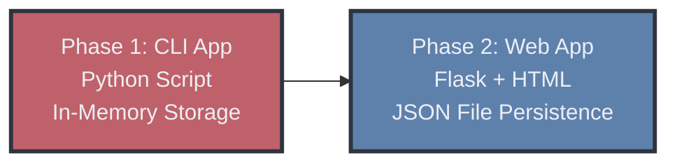

# 🖥️ IT Asset Management System


> A Flask web application for managing IT assets with persistent file-based storage. Track hardware, accessories, licenses, and user assignments through an intuitive web interface.

**Author:** Artiom Krits | **GitHub:** [@ArtiomKrits92](https://github.com/ArtiomKrits92)

---

## 📑 Table of Contents

- [Overview](#-overview)
- [Architecture Evolution](#-architecture-evolution)
- [Tech Stack](#-tech-stack)
- [Features](#-features)
- [Data Persistence](#-data-persistence)
- [Demo](#-demo)
- [Getting Started](#-getting-started)
- [Project Structure](#-project-structure)
- [API Endpoints](#-api-endpoints)
- [Lessons Learned](#-lessons-learned)
- [License](#-license)

---

## 🎯 Overview

The IT Asset Management System is a Flask web application designed to track, manage, and organize IT assets within an organization. The application provides a user-friendly web interface for managing inventory, users, and asset assignments with automatic data persistence to JSON files.

**Key Capabilities:**
- Track IT assets, accessories, and software licenses
- Assign assets to users
- Monitor inventory levels and stock valuation
- Generate reports by category and user
- Persistent data storage with JSON file-based backend

---

## 🏗️ Architecture Evolution

The project evolved from a command-line interface to a full-featured web application:



**Phase 1 → Phase 2 Improvements:**
- **Interface**: Command-line → Web-based UI with Bootstrap styling
- **Data Storage**: In-memory dictionaries → Persistent JSON files
- **User Experience**: Terminal interactions → Intuitive web forms and navigation
- **Accessibility**: Single-user script → Multi-user web application

---

## 🛠️ Tech Stack

### Frontend
- **HTML5/CSS3** - Modern, responsive web interface
- **Bootstrap 5.3** - UI framework for professional styling
- **Jinja2 Templates** - Server-side templating engine

### Backend
- **Python 3.13** - Core programming language
- **Flask 3.0** - Lightweight web framework
- **JSON** - File-based data persistence

### Development Tools
- **Git** - Version control
- **Virtual Environment** - Python dependency isolation

---

## ✨ Features

### Asset Management
- ➕ Add new IT assets (hardware, accessories, licenses)
- 🗑️ Delete assets from inventory
- ✏️ Modify existing asset details
- 📋 View all assets with filtering options

### User Management
- 👤 Add new users to the system
- 📊 View all registered users
- 🔗 Assign assets to specific users
- 📦 View assets assigned to each user

### Reporting & Analytics
- 📈 Dashboard with key metrics (total users, items, stock status)
- 💰 Stock valuation by category (Assets, Accessories, Licenses)
- 📊 Inventory status tracking (In Stock / Assigned)
- 🔍 Category-based filtering and reporting

---

## 💾 Data Persistence

The application uses JSON file-based persistence for simplicity and portability:

- **Storage Location**: `website/data/` directory
- **Files**: 
  - `items.json` - Asset inventory data
  - `users.json` - User registry and assignments
- **Automatic Operations**:
  - Data is automatically saved after each modification
  - Data is loaded on application startup
  - Files are created automatically if they don't exist

**File Format Example:**
```json
{
  "1": {
    "id": "1",
    "main_category": "Assets",
    "sub_category": "Laptop",
    "manufacturer": "Dell",
    "model": "XPS 15",
    "price": 1299.99,
    "quantity": 1,
    "status": "In Stock",
    "assigned_to": null
  }
}
```

---

## 🎬 Demo

> Screenshots and demo GIFs will be added as the project progresses

---

## 🚀 Getting Started

### Prerequisites

- Python 3.13 or higher
- pip (Python package manager)

### Local Development

1. **Clone the repository**
   ```bash
   git clone https://github.com/ArtiomKrits92/it-asset-management.git
   cd it-asset-management
   ```

2. **Create and activate virtual environment**
   ```bash
   python3 -m venv venv
   source venv/bin/activate  # On Windows: venv\Scripts\activate
   ```

3. **Install dependencies**
   ```bash
   pip install -r requirements.txt
   ```

4. **Run the application**
   ```bash
   cd website
   python app.py
   ```

5. **Access the application**
   - Open your browser and navigate to `http://localhost:31415`
   - The application will automatically create data files in `website/data/` on first run

---

## 📁 Project Structure

```
Devops_Final_Project/
│
├── website/                    # Main application directory
│   ├── app.py                 # Flask application entry point
│   ├── data.py                # Data models and in-memory databases
│   ├── file_manager.py        # File persistence layer
│   ├── demo.py                # Demo data initialization
│   │
│   ├── data/                  # Data persistence directory
│   │   ├── items.json        # Asset inventory data
│   │   └── users.json        # User registry data
│   │
│   └── templates/             # Jinja2 HTML templates
│       ├── base.html         # Base template with navigation
│       ├── index.html        # Dashboard/homepage
│       ├── add_item.html     # Add asset form
│       ├── delete_item.html  # Delete asset form
│       ├── modify_item_select.html  # Select item to modify
│       ├── modify_item_form.html    # Modify asset form
│       ├── assign_item.html  # Assign asset to user
│       ├── add_user.html     # Add user form
│       ├── show_users.html   # User listing
│       ├── show_user_items_select.html  # Select user to view items
│       ├── show_user_items.html         # View user's assigned assets
│       ├── show_stock_items.html        # Inventory listing
│       └── stock_by_categories.html     # Category reports
│
├── venv/                      # Python virtual environment
├── requirements.txt           # Python dependencies
└── README.md                  # This file
```

---

## 🔌 API Endpoints

| Method | Endpoint | Description |
|--------|----------|-------------|
| `GET` | `/` | Dashboard with statistics |
| `GET/POST` | `/add_item` | Add new asset to inventory |
| `GET/POST` | `/delete_item` | Remove asset from inventory |
| `GET` | `/modify_item` | Select item to modify |
| `GET/POST` | `/modify_item_form` | Update asset details |
| `GET/POST` | `/assign_item` | Assign asset to user |
| `GET/POST` | `/add_user` | Register new user |
| `GET` | `/show_users` | List all users |
| `GET/POST` | `/show_user_items` | View user's assigned assets |
| `GET` | `/show_stock_items` | Display all inventory items |
| `GET` | `/stock_by_categories` | Category-based stock valuation |

---

## 💡 Lessons Learned

### Development Phase
- **Modular Design**: Separating concerns (data layer, business logic, presentation) made the codebase maintainable and testable
- **File Persistence**: Implementing a simple file manager abstraction (`FileManager` class) provides a clean interface for data operations and allows for easy migration to database systems in the future
- **User Experience**: Flask's flash messaging system provides excellent feedback for user actions, improving the overall user experience
- **Template Inheritance**: Using Jinja2's template inheritance (`base.html`) reduced code duplication and simplified maintenance
- **Data Validation**: Client-side and server-side validation ensures data integrity and prevents errors

### Technical Insights
- **JSON Persistence**: While simple, JSON file storage works well for small to medium datasets and provides human-readable data
- **Flask Routing**: RESTful route design makes the application intuitive and easy to extend
- **State Management**: Careful handling of in-memory dictionaries and file synchronization prevents data loss
- **Error Handling**: Proper error handling and user feedback prevents confusion and improves reliability

---

## 📄 License

This project is licensed under the MIT License - see the [LICENSE](LICENSE) file for details.

---

## 👤 Author

**Artiom Krits**

- GitHub: [@ArtiomKrits92](https://github.com/ArtiomKrits92)
- Project Link: [https://github.com/ArtiomKrits92/it-asset-management](https://github.com/ArtiomKrits92/it-asset-management)
- LinkedIn: [https://www.linkedin.com/in/artiom-krits-%F0%9F%8E%97%EF%B8%8F-855372202/](https://www.linkedin.com/in/artiom-krits-%F0%9F%8E%97%EF%B8%8F-855372202/)

---

## 🙏 Acknowledgments

- Flask community for excellent documentation and framework
- Bootstrap team for the responsive UI framework
- Jinja2 developers for the powerful templating engine
- Open source community for invaluable tools and resources

---

**⭐ If you found this project helpful, please consider giving it a star!**
