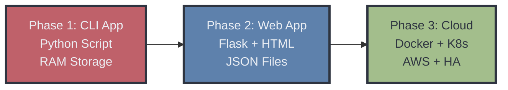
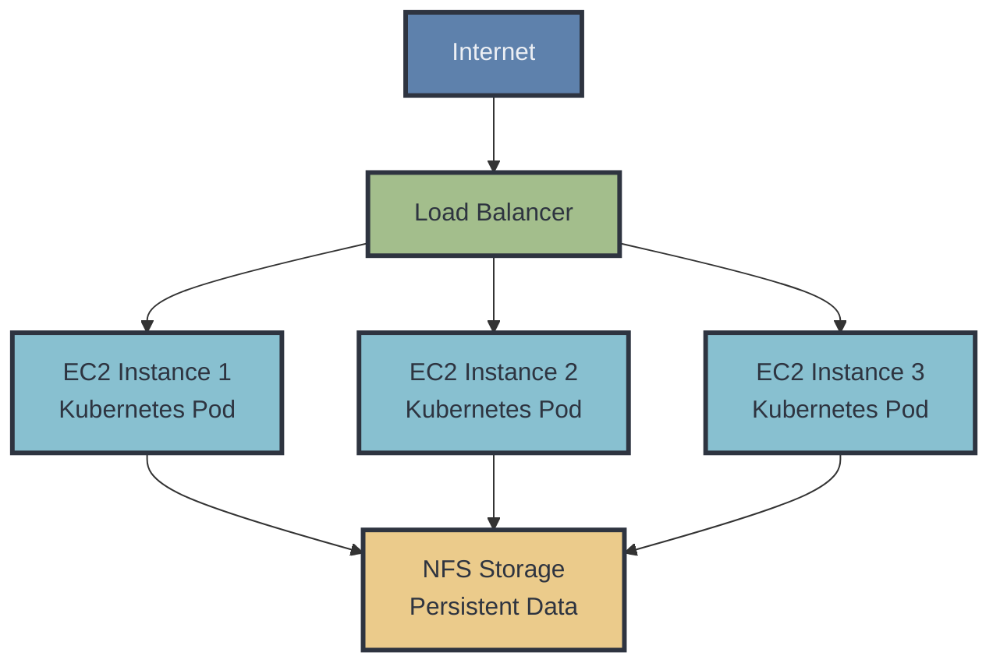

# 🖥️ IT Asset Management System - DevOps Final Project

[](https://www.python.org/)
[](https://flask.palletsprojects.com/)
[](https://www.docker.com/)
[](LICENSE)

> A comprehensive IT asset management system demonstrating modern DevOps practices, from local development to cloud-native deployment on AWS with Kubernetes orchestration.

**Author:** Artiom Krits | **GitHub:** [@ArtiomKrits92](https://github.com/ArtiomKrits92)

---

## 📑 Table of Contents

- [Overview](#-overview)
- [Architecture Evolution](#-architecture-evolution)
- [Project Progression](#-project-progression)
- [Tech Stack](#-tech-stack)
- [Features](#-features)
- [Getting Started](#-getting-started)
  - [Local Development](#local-development)
  - [Docker Deployment](#docker-deployment)
  - [AWS/Kubernetes Deployment](#awskubernetes-deployment)
- [Project Structure](#-project-structure)
- [AWS Architecture](#-aws-architecture)
- [API Endpoints](#-api-endpoints)
- [Lessons Learned](#-lessons-learned)
- [License](#-license)

---

## 🎯 Overview

The IT Asset Management System is a full-stack web application designed to track, manage, and organize IT assets within an organization. The project showcases a complete DevOps journey, evolving from a simple command-line interface to a production-ready, cloud-native application deployed on AWS with Kubernetes orchestration.

**Key Capabilities:**
- Track IT assets, accessories, and software licenses
- Assign assets to users
- Monitor inventory levels and stock valuation
- Generate reports by category and user
- Persistent data storage with JSON file-based backend

---

## 🏗️ Architecture Evolution

The project has evolved through three distinct phases, each building upon the previous iteration:


```mermaid
graph LR
    A[Phase 1: CLI App<br/>Python Script<br/>RAM Storage] --> B[Phase 2: Web App<br/>Flask + HTML<br/>JSON Files]
    B --> C[Phase 3: Cloud<br/>Docker + K8s<br/>AWS + HA]
    
    style A fill:#bf616a,stroke:#2e3440,stroke-width:3px,color:#eceff4
    style B fill:#5e81ac,stroke:#2e3440,stroke-width:3px,color:#eceff4
    style C fill:#a3be8c,stroke:#2e3440,stroke-width:3px,color:#2e3440
```

---

## 📊 Project Progression

| Feature | Phase 1: CLI | Phase 2: Web App | Phase 3: Cloud |
|---------|-------------|------------------|----------------|
| **Interface** | Command-line | Web UI (Flask) | Web UI (Containerized) |
| **Data Storage** | In-memory | JSON files | Persistent volumes |
| **Deployment** | Local script | Local server | AWS (K8s) |
| **Scalability** | Single user | Single instance | Auto-scaling pods |
| **Infrastructure** | None | Manual setup | Infrastructure as Code |
| **Orchestration** | N/A | N/A | Kubernetes |
| **Monitoring** | Print statements | Flask debug | CloudWatch/Logging |
| **CI/CD** | Manual | Manual | Automated pipeline |
| **High Availability** | No | No | Multi-AZ deployment |

---

## 🛠️ Tech Stack

### Frontend
- **HTML5/CSS3** - Modern, responsive web interface
- **Jinja2 Templates** - Server-side templating engine
- **Bootstrap** - UI framework for styling

### Backend
- **Python 3.13** - Core programming language
- **Flask 3.0** - Lightweight web framework
- **JSON** - File-based data persistence

### DevOps & Infrastructure
- **Docker** - Containerization platform
- **Kubernetes** - Container orchestration
- **Terraform** - Infrastructure as Code (IaC)
- **Ansible** - Configuration management
- **AWS** - Cloud platform (EKS, ECS, EC2, VPC, etc.)

### Development Tools
- **Git** - Version control
- **Virtual Environment** - Python dependency isolation

---

## ✨ Features

### Asset Management
- ➕ Add new IT assets (hardware, accessories, licenses)
- 🗑️ Delete assets from inventory
- ✏️ Modify existing asset details
- 📋 View all assets with filtering options

### User Management
- 👤 Add new users to the system
- 📊 View all registered users
- 🔗 Assign assets to specific users
- 📦 View assets assigned to each user

### Reporting & Analytics
- 📈 Dashboard with key metrics
- 💰 Stock valuation by category
- 📊 Inventory status tracking (In Stock / Assigned)
- 🔍 Category-based filtering and reporting

### Data Persistence
- 💾 Automatic data persistence to JSON files
- 🔄 Data loading on application startup
- ✅ Atomic save operations

---

## 🚀 Getting Started

### Prerequisites

- Python 3.13 or higher
- pip (Python package manager)
- Docker (for containerized deployment)
- kubectl (for Kubernetes deployment)
- AWS CLI (for cloud deployment)
- Terraform (for infrastructure provisioning)

### Local Development

1. **Clone the repository**
   ```bash
   git clone https://github.com/ArtiomKrits92/it-asset-management.git
   cd it-asset-management
   ```

2. **Create and activate virtual environment**
   ```bash
   python3 -m venv venv
   source venv/bin/activate  # On Windows: venv\Scripts\activate
   ```

3. **Install dependencies**
   ```bash
   pip install -r requirements.txt
   ```

4. **Run the application**
   ```bash
   cd website
   python app.py
   ```

5. **Access the application**
   - Open your browser and navigate to `http://localhost:31415`
   - The application will automatically create data files on first run

### Docker Deployment

1. **Build the Docker image**
   ```bash
   docker build -t it-asset-management:latest .
   ```

2. **Run the container**
   ```bash
   docker run -d -p 31415:31415 \
     -v $(pwd)/website/data:/app/data \
     --name it-asset-mgmt \
     it-asset-management:latest
   ```

3. **Access the application**
   - Navigate to `http://localhost:31415`

### 🔐 AWS Credentials Setup

Before deploying to AWS, you need to configure your AWS credentials. The setup method depends on your environment and whether you're using AWS Academy or standard AWS accounts.

#### GitHub Actions Secrets

For CI/CD pipelines using GitHub Actions, add the following secrets to your repository:

1. Navigate to your repository on GitHub
2. Go to **Settings** → **Secrets and variables** → **Actions**
3. Click **New repository secret** and add:
   - `AWS_ACCESS_KEY_ID`: Your AWS access key ID
   - `AWS_SECRET_ACCESS_KEY`: Your AWS secret access key
   - `AWS_SESSION_TOKEN`: Your AWS session token (required for temporary credentials)

**Note:** If using AWS Academy, session tokens expire after 4 hours. You'll need to refresh these secrets periodically or use a script to automate token rotation.

#### Local Setup

**Option 1: AWS Credentials File (Recommended)**

Create or edit `~/.aws/credentials`:

```ini
[default]
aws_access_key_id = YOUR_ACCESS_KEY_ID
aws_secret_access_key = YOUR_SECRET_ACCESS_KEY
aws_session_token = YOUR_SESSION_TOKEN
```

For AWS Academy credentials, the session token is required and must be updated every 4 hours.

**Option 2: Environment Variables**

Export credentials as environment variables in your shell:

```bash
export AWS_ACCESS_KEY_ID="your-access-key-id"
export AWS_SECRET_ACCESS_KEY="your-secret-access-key"
export AWS_SESSION_TOKEN="your-session-token"
```

To persist these across sessions, add them to your `~/.bashrc` or `~/.zshrc`:

```bash
echo 'export AWS_ACCESS_KEY_ID="your-access-key-id"' >> ~/.zshrc
echo 'export AWS_SECRET_ACCESS_KEY="your-secret-access-key"' >> ~/.zshrc
echo 'export AWS_SESSION_TOKEN="your-session-token"' >> ~/.zshrc
source ~/.zshrc
```

#### Security Best Practices

⚠️ **Important:** Never commit AWS credentials to version control. Always use:
- GitHub Secrets for CI/CD pipelines
- Local credentials files (excluded via `.gitignore`)
- Environment variables for local development
- AWS IAM roles when running on EC2 instances

Verify your credentials are excluded from Git:

```bash
# Ensure .gitignore includes:
.aws/
*.pem
.env
```

### AWS/Kubernetes Deployment

1. **Provision infrastructure with Terraform**
   ```bash
   cd terraform
   terraform init
   terraform plan
   terraform apply
   ```

2. **Configure Kubernetes cluster**
   ```bash
   aws eks update-kubeconfig --name <cluster-name>
   ```

3. **Deploy application with Ansible**
   ```bash
   cd ansible
   ansible-playbook -i inventory deploy.yml
   ```

4. **Access the application**
   - Use the Load Balancer URL provided by Terraform outputs

---

## 📁 Project Structure

```
Devops_Final_Project/
│
├── website/                    # Main application directory
│   ├── app.py                 # Flask application entry point
│   ├── data.py                # Data models and in-memory databases
│   ├── file_manager.py        # File persistence layer
│   ├── demo.py                # Demo data initialization
│   │
│   ├── data/                  # Data persistence directory
│   │   ├── items.json        # Asset inventory data
│   │   └── users.json        # User registry data
│   │
│   └── templates/             # Jinja2 HTML templates
│       ├── base.html         # Base template with navigation
│       ├── index.html        # Dashboard/homepage
│       ├── add_item.html     # Add asset form
│       ├── delete_item.html  # Delete asset form
│       ├── modify_item_*.html # Modify asset forms
│       ├── assign_item.html  # Assign asset to user
│       ├── add_user.html     # Add user form
│       ├── show_users.html   # User listing
│       ├── show_user_items*.html # User asset views
│       ├── show_stock_items.html # Inventory listing
│       └── stock_by_categories.html # Category reports
│
├── venv/                      # Python virtual environment
├── requirements.txt           # Python dependencies
├── Dockerfile                 # Docker container definition
├── docker-compose.yml         # Multi-container orchestration
├── terraform/                 # Infrastructure as Code
│   ├── main.tf               # Main Terraform configuration
│   ├── variables.tf          # Variable definitions
│   ├── outputs.tf            # Output values
│   └── *.tf                  # Additional resource definitions
├── ansible/                   # Configuration management
│   ├── playbooks/            # Ansible playbooks
│   ├── roles/                # Reusable roles
│   └── inventory/            # Server inventory
├── kubernetes/                # K8s manifests
│   ├── deployment.yaml       # Application deployment
│   ├── service.yaml          # Service definition
│   └── ingress.yaml          # Ingress configuration
└── README.md                  # This file
```

---

## ☁️ AWS Architecture


```mermaid
graph TB
    Internet[Internet] --> LB[Load Balancer]
    LB --> EC2-1[EC2 Instance 1<br/>Kubernetes Pod]
    LB --> EC2-2[EC2 Instance 2<br/>Kubernetes Pod]
    LB --> EC2-3[EC2 Instance 3<br/>Kubernetes Pod]
    EC2-1 --> NFS[NFS Storage<br/>Persistent Data]
    EC2-2 --> NFS
    EC2-3 --> NFS
    
    style Internet fill:#5e81ac,stroke:#2e3440,stroke-width:3px,color:#eceff4
    style LB fill:#a3be8c,stroke:#2e3440,stroke-width:3px,color:#2e3440
    style EC2-1 fill:#88c0d0,stroke:#2e3440,stroke-width:3px,color:#2e3440
    style EC2-2 fill:#88c0d0,stroke:#2e3440,stroke-width:3px,color:#2e3440
    style EC2-3 fill:#88c0d0,stroke:#2e3440,stroke-width:3px,color:#2e3440
    style NFS fill:#ebcb8b,stroke:#2e3440,stroke-width:3px,color:#2e3440
```

**Key Components:**
- **Load Balancer**: Distributes traffic across multiple availability zones
- **EKS/ECS Cluster**: Kubernetes orchestration for container management
- **Multi-AZ Deployment**: High availability across availability zones
- **EBS Volumes**: Persistent storage for application data
- **VPC**: Isolated network environment with security groups
- **CloudWatch**: Centralized logging and monitoring

---

## 🔌 API Endpoints

| Method | Endpoint | Description |
|--------|----------|-------------|
| `GET` | `/` | Dashboard with statistics |
| `GET/POST` | `/add_item` | Add new asset to inventory |
| `GET/POST` | `/delete_item` | Remove asset from inventory |
| `GET` | `/modify_item` | Select item to modify |
| `GET/POST` | `/modify_item_form` | Update asset details |
| `GET/POST` | `/assign_item` | Assign asset to user |
| `GET/POST` | `/add_user` | Register new user |
| `GET` | `/show_users` | List all users |
| `GET/POST` | `/show_user_items` | View user's assigned assets |
| `GET` | `/show_stock_items` | Display all inventory items |
| `GET` | `/stock_by_categories` | Category-based stock valuation |

---

## 💡 Lessons Learned

### Development Phase
- **Modular Design**: Separating concerns (data layer, business logic, presentation) made the codebase maintainable and testable
- **File Persistence**: Implementing a simple file manager abstraction allowed for easy migration to database systems later
- **User Experience**: Flask's flash messaging system provides excellent feedback for user actions

### Containerization Phase
- **Docker Best Practices**: Multi-stage builds and proper layer caching significantly reduced image sizes
- **Data Persistence**: Understanding volume mounts and persistent storage was crucial for stateful applications
- **Port Configuration**: Proper port mapping and environment variable configuration enabled flexible deployments

### Cloud Deployment Phase
- **Infrastructure as Code**: Terraform enabled reproducible, version-controlled infrastructure deployments
- **Kubernetes Orchestration**: Learning pod management, services, and deployments provided deep insights into container orchestration
- **High Availability**: Multi-AZ deployments and load balancing are essential for production systems
- **Configuration Management**: Ansible playbooks automated repetitive configuration tasks across multiple nodes
- **Monitoring & Logging**: Centralized logging with CloudWatch is critical for debugging distributed systems

### DevOps Best Practices
- **Version Control**: Git workflows and branching strategies streamlined collaboration
- **CI/CD Pipelines**: Automated testing and deployment reduced manual errors
- **Security**: Implementing security groups, IAM roles, and secrets management from the start
- **Cost Optimization**: Right-sizing resources and using spot instances where appropriate
- **Documentation**: Comprehensive README and inline documentation saved significant time during deployment

### Challenges Overcome
- **State Management**: Transitioning from in-memory to persistent storage required careful data migration strategies
- **Networking**: Understanding VPCs, subnets, and security groups was initially complex but essential
- **Scaling**: Learning to design stateless applications that can scale horizontally
- **Debugging**: Distributed systems debugging required new tools and methodologies

---

## 📄 License

This project is licensed under the MIT License - see the [LICENSE](LICENSE) file for details.

---

## 👤 Author

**Artiom Krits**

- GitHub: [@ArtiomKrits92](https://github.com/ArtiomKrits92)
- Project Link: [https://github.com/ArtiomKrits92/it-asset-management](https://github.com/ArtiomKrits92/it-asset-management)
- LinkedIn: https://www.linkedin.com/in/artiom-krits-%F0%9F%8E%97%EF%B8%8F-855372202/
---

## 🙏 Acknowledgments

- Flask community for excellent documentation and framework
- AWS for comprehensive cloud services and documentation
- Kubernetes community for robust container orchestration tools
- Open source community for invaluable tools and resources

---

**⭐ If you found this project helpful, please consider giving it a star!**

